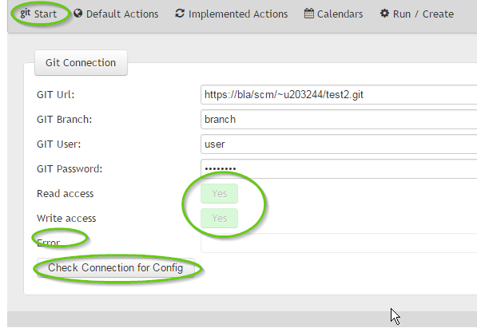
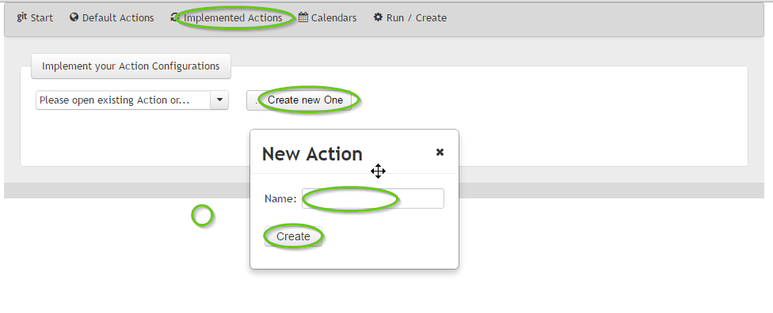
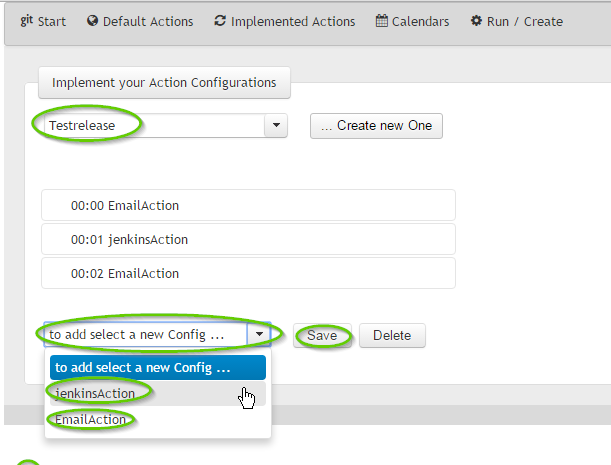
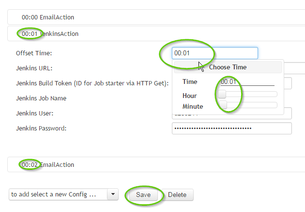
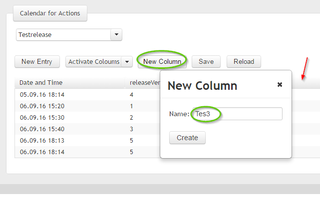
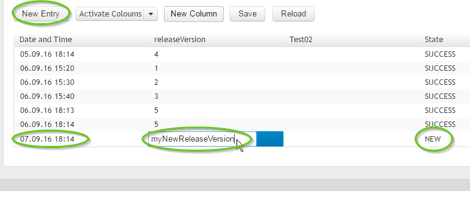
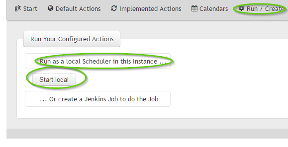
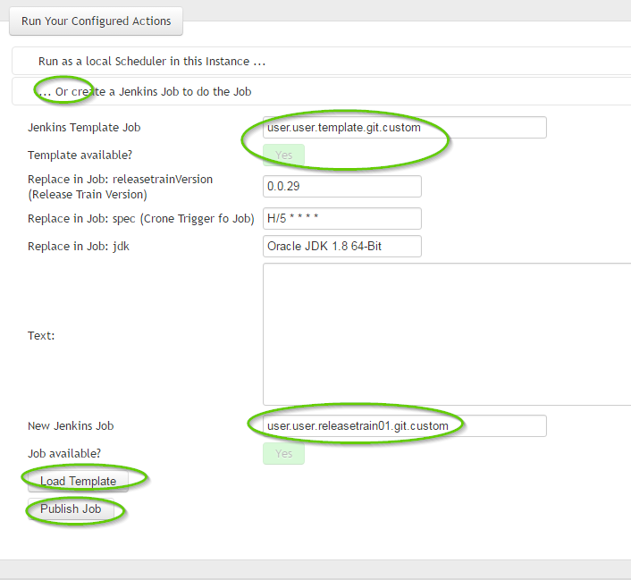

# Releasetrain
This is a tool that is easy to use and that integrates 
* Parametrized Jenkins Jobs, 
* Email Notification Actions and  
* other Build and Release steps (planned)

in one simple configurable application.

The main goal ist to schedule builds with custom Release Numbers and other Parameters. It can run as a standalone Spring Boot Webapp or it can generate a custom Jenkins Job as a trigger for the configured build events.

## Advantages
- It uses an existig git repo to store Action Configurations and the corresponding Calendars with custom Parameters
- A Calendar can have a custom amount of Columns, which are mapped automatically to parametrized Jenkins Jobs
- Scheduled Jobs can be launced from the Spring Boot app or from a generated Jenkins Job. It suffices to launch a Maven Mojo, 
which will be installed automatically from Maven Central.

## Updates
- 0.9.4 - Saving the Config before refresing on the git configuration
        - Blocking Window when refreshing git connection
        - Rest call to http://search.maven.org/ for the latest version when generating the jenkins job 

## For Developers
- Feel free to fork or to create a pull requests.
- Implementations of more Custom Actions are welcome, please let me know if you need help or if you need better interfaces.

### Travis-CI: 

## For Users
### Setup

1. Download the Spring Boot App: [From Maven Central](http://repo1.maven.org/maven2/ch/sbb/releasetrain/webui/0.0.29/webui-0.0.29.jar).
2. Start from command line the command: _java -jar webui-0.0.29.jar_.
3. On Windows the default browser will open and the webapp is shown at [http://localhost:8080](http://localhost:8080).

### Usage
#### On the Menu open Start as shown below:

- Here you have to provide the connection to an existing git repo.
- The git branch is required to store the configuration files in Yaml Format; the branch will be created if it does not yet exist.
- You can see the 2 green buttons for read and write access to the git connection and branch. 
- If you see errors in the error field, fix the config and "Check Connection for Config" again.
- The provided connection information will be stored in the user's home directory under ./releasetrain/gitConfig.yaml.
The password is lightly encrypted in order not to store it in  plaintext (however, it's easy to find the key so, it's not a big deal to decrypt at all...)

#### Insert the Default Action Configuration for Jenkins and Email Actions:

- The build token is for Jenkins Jobs with the "Trigger builds remotely (e.g., from scripts)" selected

- Provide the default e-mail parameters. In this version there is no option for an SMTP Server with authentication.
Please file a ticket or open a pull request if you need this option.
- The default actions will be stored in a file in the branch in the configured git repo.

#### Implement your new Actions:

- First insert the Name of the Action, the Action will have its own Calendar with 1 to n scheduled events.
- An Action can have one or more Actions (Jenkins and Email Actions).

- An Action can have one or more Actions (Jenkins and Email Actions)

- Every Action has its own Configuration.
- You can set a time offset for every Action; an Action with offset 0:00 will start right at time given in the schedule.
- An time offset means that the execution of this step will wait for the provided time to finish.

#### Create the Calendar for each Action:

- You can add columns as shown above. The column Name will be automatically mapped to Jenkins Action Parameters and to Email Text Variables.

- As shown above you can disable Columns if not required for the action.

- With New Entry you now can schedule your Actions whenever you need to run them.
- In the State Column you can see the State of Actions already Succeded or in Error State.

#### Run Create Actions

- For local Testing you can hit the Start local button.

- As shown above you can export a Jenkins Job by providing an existing Template Job on your Jenkins
- First, you have to load the config as XML.
- Then you can publish the job to Jenkins.
- Fields above will be replaced in the XML or you can edit the Config in the Text Field...
