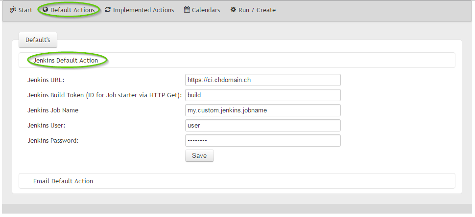
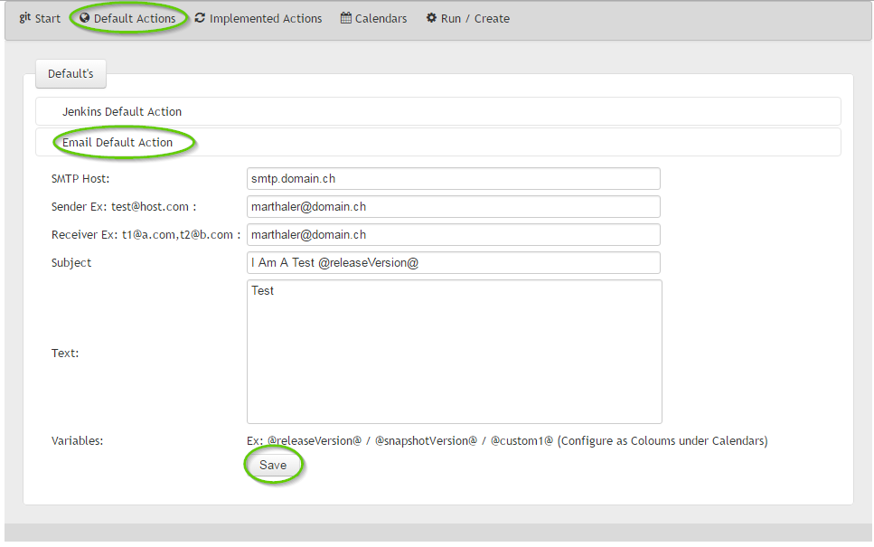

# Releasetrain
It's an easy to use Tool, that integrates Parametrized Jenkins Jobs, Email Notification Actions and later on other Build and Release steps in one Simple Configurable Application.

Main goal ist to schedule Builds with custom Release Numbers and other Parameters. It can run as a standalone Spring Boot Webapp or it can generate a custom Jenkins Job as a trigger for the configured Buildevents.

## Advantages
- It uses an existig Git Repo to store Action Configurations and the according Calendars with the custom Parameters
- A Calendar can have a custom amount of Coloums, that are mapped automattically on parametrized Jenkins Jobs
- Scheduled Jobs could be Executed from the Spring Boot app or from a generated Jenkins Job. The Runner for that is a Maven Mojo that will be installed automatically from the Maven Central Repository

## For Developers
- Feel free to Fork or to create a pullrequest
- Implementations of more Custom Actions are Welcome, please let me know if you need help or if you need better Interfaces

### Travis-CI: 

## For Users
### Setup

1. Download the Spring Boot App: [From Maven Central](http://repo1.maven.org/maven2/ch/sbb/releasetrain/webui/0.0.29/webui-0.0.29.jar)
2. Start from Commandlinetoll with the command: _java -jar webui-0.0.29.jar_
3. On Windows the default Browser will open an the Webapp is shown: [http://localhost:8080](http://localhost:8080)

### Usage
#### On the Menu open Start as shown below:

- Here you have to provide Connection informations to a existing Git Repo
- The Git Branch will be created if not already exists, this one will be used to store the Configuration Files in Yaml Format
- You can see the 2 green Buttons for read and write acces to the Git connection and branch. 
- If you see errors in the Error field fix the config and "Check Connection for Config" again
- The Provided Connection Informations will be stored in the User home under ./releasetrain/gitConfig.yaml
the Password is encrypted so anyone can't read it in plaintext. It's easy to find the key so, it's not a big deal to decrypt at all...

#### Insert the Default Action Configuration for Jenkins and Email Actions:

- The Build token is for Jenkins Jobs with the "Trigger builds remotely (e.g., from scripts)" selected

- Provide the Tempalte Email Information. In this Version there is no Option for a SMTP Server with Autentication, Please request a Ticket or open a Pullrequest if you need this option
- The Default Action's will be the first Config Files on the branch on the configured Git Repo

